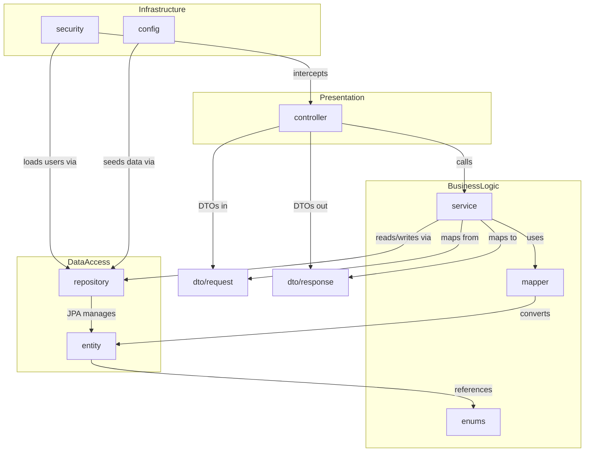
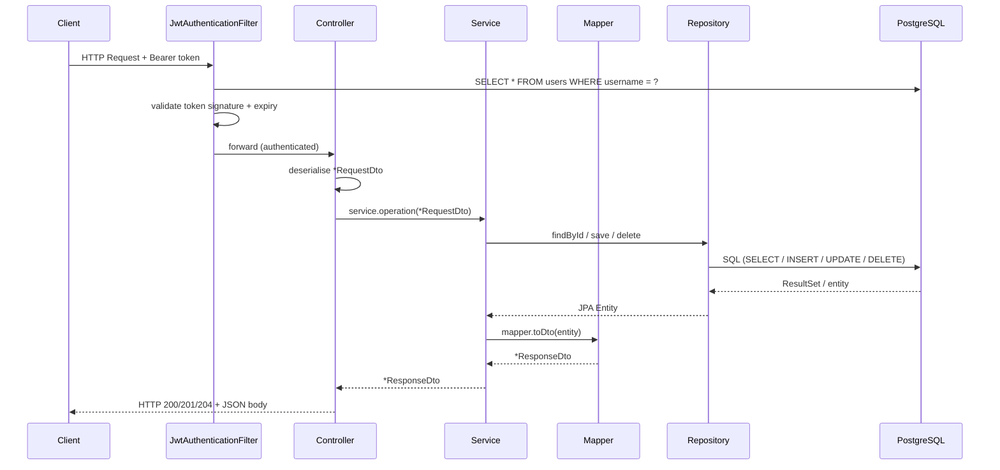
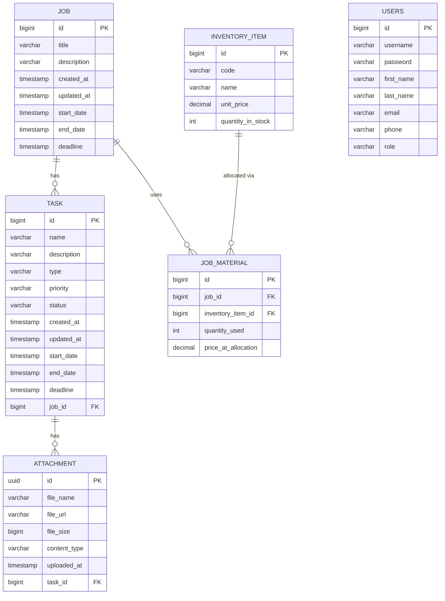

# SMAPI — System Architecture Guide

> **Smart Management API** | Spring Boot 4.1 · Java 17 · PostgreSQL · JWT Bearer Auth  
> Version `0.0.1-SNAPSHOT` — Last reviewed: 2025

---

## Table of Contents

1. [Architectural Pattern](#1-architectural-pattern)
2. [Package & Directory Structure](#2-package--directory-structure)
3. [Component & Layer Responsibility Breakdown](#3-component--layer-responsibility-breakdown)
4. [Domain Model & Entity Relationships](#4-domain-model--entity-relationships)
5. [Cross-Layer Data Flow](#5-cross-layer-data-flow)
6. [Security Architecture](#6-security-architecture)
7. [API Surface](#7-api-surface)
8. [Dependency Graph & External Integrations](#8-dependency-graph--external-integrations)
9. [Architecture Diagrams](#9-architecture-diagrams)
10. [Impact Evaluation Matrix](#10-impact-evaluation-matrix)

---

## 1. Architectural Pattern

SMAPI follows a **Classic 3-Tier Layered Architecture** implemented within a single deployable Spring Boot application (monolith).

```
┌─────────────────────────────────┐
│  Presentation Layer             │  Controllers + DTOs + Swagger UI
├─────────────────────────────────┤
│  Business Logic Layer           │  Services + Mappers + Enums
├─────────────────────────────────┤
│  Data Access Layer              │  Repositories + JPA Entities
└─────────────────────────────────┘
          │
          ▼
   PostgreSQL Database
```

**Key characteristics:**
- **Strict unidirectional dependency**: Controllers → Services → Repositories. No layer calls upward.
- **DTO boundary**: All HTTP traffic is expressed through Request/Response DTOs. JPA entities never leave the service layer.
- **Mapper components**: A dedicated `mapper` package handles all entity ↔ DTO conversions, keeping services free of transformation boilerplate.
- **Stateless runtime**: JWT-based authentication; no HTTP sessions (`SessionCreationPolicy.STATELESS`).
- **Cross-cutting concerns**: Security (`JwtAuthenticationFilter`) and API documentation (`OpenApiConfig`) are configured as infrastructure concerns outside the domain layers.

---

## 2. Package & Directory Structure

```
com.coding_project.smapi/
│
├── SmapiApplication.java          # Entry point — @SpringBootApplication
│
├── config/
│   ├── DataInitializer.java        # Seeds the default ROLE_ADMIN user on startup
│   └── OpenApiConfig.java          # Global OpenAPI 3.x spec + JWT Bearer scheme
│
├── controller/                     # PRESENTATION LAYER — HTTP request handlers
│   ├── WelcomeController.java      # GET /          (public health-check)
│   ├── UserController.java         # POST /auth/**  (registration & login)
│   ├── JobController.java          # /jobs/**
│   ├── TaskController.java         # /tasks/**
│   ├── AttachmentController.java   # /tasks/{id}/add-attachment, /tasks/{id}/attachment/{uuid}
│   ├── InventoryController.java    # /inventory/**
│   └── JobMaterialController.java  # /jobs/{jobId}/materials/**
│
├── dto/
│   ├── request/                    # Inbound JSON payloads (client → API)
│   │   ├── AuthRequest.java
│   │   ├── RegisterRequest.java
│   │   ├── JobRequestDto.java
│   │   ├── TaskRequestDto.java
│   │   ├── AttachmentRequestDto.java
│   │   ├── InventoryItemRequestDto.java
│   │   └── JobMaterialRequestDto.java
│   └── response/                   # Outbound JSON shapes (API → client)
│       ├── AuthResponse.java
│       ├── JobResponseDto.java
│       ├── TaskResponseDto.java
│       ├── AttachmentResponseDto.java
│       ├── InventoryItemResponseDto.java
│       └── JobMaterialResponseDto.java
│
├── entity/                         # DATA ACCESS LAYER — JPA-managed domain objects
│   ├── User.java
│   ├── Job.java
│   ├── Task.java
│   ├── Attachment.java
│   ├── InventoryItem.java
│   └── JobMaterial.java
│
├── enums/                          # Shared type vocabulary
│   ├── Role.java                   # ROLE_USER, ROLE_ADMIN
│   ├── JobStatus.java              # PENDING, OPEN, CLOSED, IMMINENT, OVERDUE
│   ├── TaskStatus.java             # CREATED, IN_PROGRESS, BLOCKED, IN_REVIEW, DONE, CANCELLED
│   ├── TaskType.java               # FEATURE, BUG, TECHNICAL_DEBT, RESEARCH, MAINTENANCE, OTHER
│   └── Priority.java               # CRITICAL, HIGH, MEDIUM, LOW
│
├── mapper/                         # BUSINESS LOGIC LAYER — entity ↔ DTO translation
│   ├── JobMapper.java              # Includes cost-summary computation (50% service fee)
│   ├── TaskMapper.java             # Supports optional jobId inclusion (avoids circular nesting)
│   ├── AttachmentMapper.java
│   ├── InventoryItemMapper.java
│   └── JobMaterialMapper.java
│
├── repository/                     # DATA ACCESS LAYER — Spring Data JPA interfaces
│   ├── UserRepository.java
│   ├── JobRepository.java          # Custom JPQL queries for status filtering
│   ├── TaskRepository.java
│   ├── AttachmentRepository.java
│   ├── InventoryRepository.java
│   └── JobMaterialRepository.java
│
├── security/                       # CROSS-CUTTING — JWT + Spring Security
│   ├── SecurityConfig.java         # Filter chain, CSRF disabled, stateless sessions
│   ├── JwtAuthenticationFilter.java # OncePerRequestFilter — validates Bearer token
│   ├── JwtUtil.java                # Token generation, signature verification, claim extraction
│   └── CustomUserDetailsService.java # UserDetailsService — loads User from DB by username
│
└── service/                        # BUSINESS LOGIC LAYER — use-case orchestration
    ├── UserService.java
    ├── JobService.java
    ├── TaskService.java
    ├── AttachmentService.java
    ├── InventoryService.java
    └── JobMaterialService.java
```

---

## 3. Component & Layer Responsibility Breakdown

### 3.1 Presentation Layer — `controller/`

| Controller | Base Path | Key Responsibilities |
|---|---|---|
| `WelcomeController` | `GET /` | Public health-check; no auth required |
| `UserController` | `/auth` | Registration (`POST /register`), login (`POST /login`); both return a signed JWT |
| `JobController` | `/jobs` | Full CRUD + status-filter read; delegates entirely to `JobService` |
| `TaskController` | `/tasks` | Full CRUD + filter by status, priority, and deadline window |
| `AttachmentController` | `/tasks/{id}/...` | Adds file metadata records to a Task; removes by UUID |
| `InventoryController` | `/inventory` | List all SKUs; batch-restock endpoint (upsert logic) |
| `JobMaterialController` | `/jobs/{jobId}/materials` | Allocate/list/remove material allocations with automatic inventory deduction |

> **Design note:** Controllers are thin. They receive a DTO, pass it to the service, and return the service's response directly. No business logic exists in any controller.

All resource controllers except `UserController` and `WelcomeController` are protected by `@SecurityRequirement(name = "bearerAuth")`.

---

### 3.2 Business Logic Layer — `service/` + `mapper/`

| Service | Responsibilities |
|---|---|
| `UserService` | Encodes passwords with `BCryptPasswordEncoder`; authenticates via `AuthenticationManager`; issues JWTs via `JwtUtil` |
| `JobService` | CRUD for Jobs; status-based filtering using custom JPQL queries (PENDING / OPEN / CLOSED / OVERDUE / IMMINENT). Status is **computed at query-time** from date fields — not stored as a column |
| `TaskService` | CRUD for Tasks; resolves parent `Job` FK on create/update; filters by `TaskStatus`, `Priority`, and a look-ahead deadline window |
| `AttachmentService` | Records file references (URL, size, MIME type) against a parent Task — **does not perform file storage** |
| `InventoryService` | Lists all SKUs; batch-restocks by code (updates existing or creates new); wrapped in `@Transactional` |
| `JobMaterialService` | Allocates inventory items to Jobs; enforces stock availability; decrements `quantityInStock` on allocation, increments on removal; captures `priceAtAllocation` at point-in-time |

| Mapper | Responsibilities |
|---|---|
| `JobMapper` | Maps `Job` → `JobResponseDto`; computes `totalMaterialsCost`, `serviceFee` (50 %), and `overallCost` |
| `TaskMapper` | Maps `Task` → `TaskResponseDto`; `includeJobId` flag prevents circular JSON nesting when called from `JobMapper` |
| `AttachmentMapper` | Flat field copy: `Attachment` → `AttachmentResponseDto` |
| `InventoryItemMapper` | Flat field copy: `InventoryItem` → `InventoryItemResponseDto` |
| `JobMaterialMapper` | Maps allocation + referenced `InventoryItem` name/code into `JobMaterialResponseDto` |

---

### 3.3 Data Access Layer — `repository/` + `entity/`

All repositories extend `JpaRepository<T, ID>` (Spring Data JPA), providing standard CRUD automatically.

| Repository | Custom Queries |
|---|---|
| `JobRepository` | 5 custom JPQL queries for status-based filtering (pending, open, closed, overdue, imminent) |
| `TaskRepository` | `findByStatus`, `findByPriority`, `findByDeadlineBetween` |
| `InventoryRepository` | `findByCodeIn(List<String>)` — batch lookup by SKU code |
| `JobMaterialRepository` | `findByJobId(Long)` |
| `UserRepository` | `findByUsername(String)` |
| `AttachmentRepository` | Standard CRUD only |

---

### 3.4 Infrastructure / Config — `config/` + `security/`

| Component | Role |
|---|---|
| `SecurityConfig` | Defines the Spring Security filter chain; whitelists `/auth/**` and all Swagger/OpenAPI paths; enforces JWT on all other routes |
| `JwtAuthenticationFilter` | Runs once per request before `UsernamePasswordAuthenticationFilter`; extracts and validates the Bearer token and populates the `SecurityContext` |
| `JwtUtil` | Signs tokens with HMAC-SHA using a Base64-encoded secret; expiration defaults to 86,400,000 ms (24 h) unless overridden via `JWT_EXPIRATION` env var |
| `CustomUserDetailsService` | Loads `User` entity (which implements `UserDetails`) from the database for Spring Security authentication |
| `OpenApiConfig` | Configures the global OpenAPI 3.x spec: app metadata, two server entries (local & production), and a global JWT Bearer security scheme |
| `DataInitializer` | Seeds a hardcoded `ROLE_ADMIN` user (`ajurje`) on first startup if not present |

---

## 4. Domain Model & Entity Relationships

```
User
  id PK (BIGINT, identity)
  username, password (BCrypt), firstName, lastName, email, phone
  role: ROLE_USER | ROLE_ADMIN
  implements: UserDetails

Job
  id PK (BIGINT, identity)
  title*, description*
  createdAt (auto), updatedAt (auto)
  startDate, endDate, deadline
  ├── tasks       [1:N → Task]        CASCADE ALL, orphanRemoval
  └── materials   [1:N → JobMaterial] CASCADE ALL, orphanRemoval

Task
  id PK (BIGINT, identity)
  name, description
  type: TaskType (FEATURE | BUG | TECHNICAL_DEBT | RESEARCH | MAINTENANCE | OTHER)
  priority: Priority (CRITICAL | HIGH | MEDIUM | LOW)
  status: TaskStatus (CREATED | IN_PROGRESS | BLOCKED | IN_REVIEW | DONE | CANCELLED)
  createdAt (auto), updatedAt (auto)
  startDate, endDate, deadline
  job_id FK → Job             (ManyToOne, LAZY)
  └── attachments [1:N → Attachment] CASCADE ALL, orphanRemoval

Attachment
  id PK (UUID, auto-generated)
  fileName (unique), fileUrl, fileSize, contentType
  uploadedAt (auto)
  task_id FK → Task           (ManyToOne, LAZY)

InventoryItem
  id PK (BIGINT, identity)
  code (unique), name (unique)
  unitPrice (BigDecimal)
  quantityInStock (int, default 0)

JobMaterial
  id PK (BIGINT, identity)
  job_id FK → Job             (ManyToOne, LAZY)
  inventory_item_id FK → InventoryItem (ManyToOne, LAZY)
  quantityUsed (int)
  priceAtAllocation (BigDecimal)  ← snapshot of unitPrice at allocation time
```

**Relationship summary:**

- A **Job** has many **Tasks** and many **JobMaterials** (both cascade delete).
- A **Task** has many **Attachments** (cascade delete).
- A **JobMaterial** links a **Job** to an **InventoryItem** and records the allocation quantity and price at time of allocation — acting as a historical snapshot even if `InventoryItem.unitPrice` changes later.
- **User** is independent of the domain graph — authentication only, no FK to Jobs or Tasks.

---

## 5. Cross-Layer Data Flow

### 5.1 Standard Request–Response Lifecycle (Create Job)

```
HTTP Client
    │  POST /jobs/add
    │  Authorization: Bearer <jwt>
    │  Body: { "title": "...", "deadline": "..." }
    ▼
JwtAuthenticationFilter
    │  Extracts token from Authorization header
    │  Calls JwtUtil.extractUsername() + isTokenValid()
    │  Loads UserDetails via CustomUserDetailsService
    │  Populates SecurityContextHolder
    ▼
DispatcherServlet → JobController.createJob(JobRequestDto)
    │  Receives deserialised JobRequestDto (Jackson)
    │  No validation beyond null-checks in the service
    ▼
JobService.createJob(JobRequestDto)
    │  Constructs new Job entity from DTO fields
    │  Calls JobRepository.save(job)
    ▼
JobRepository (JPA / Hibernate)
    │  Executes INSERT INTO jobs (...)
    │  @CreatedDate / @LastModifiedDate auto-populated by JPA Auditing
    │  Returns managed Job entity with generated ID
    ▼
JobService
    │  Passes saved Job to JobMapper.toDto(job)
    ▼
JobMapper.toDto(Job)
    │  Maps scalar fields
    │  Maps tasks (via TaskMapper) and materials (via JobMaterialMapper)
    │  Computes totalMaterialsCost, serviceFee (50%), overallCost
    │  Returns JobResponseDto
    ▼
JobController
    │  Wraps in ResponseEntity.status(201).body(dto)
    ▼
HTTP Client
    │  HTTP 201 Created
    │  Body: { "id": 42, "title": "...", "totalMaterialsCost": 0, ... }
```

### 5.2 Authentication Flow (Login)

```
HTTP Client
    │  POST /auth/login  { "username": "...", "password": "..." }
    ▼
SecurityConfig (route is .permitAll())
    ▼
UserController.login(AuthRequest)
    ▼
UserService.login(AuthRequest)
    │  AuthenticationManager.authenticate(UsernamePasswordAuthenticationToken)
    │    └─ DaoAuthenticationProvider
    │         └─ CustomUserDetailsService.loadUserByUsername()
    │              └─ UserRepository.findByUsername()
    │         └─ BCryptPasswordEncoder.matches()
    │  UserRepository.findByUsername() (second fetch for entity)
    │  JwtUtil.generateToken(user)
    ▼
AuthResponse { "token": "<signed-jwt>" }
    ▼
HTTP Client
```

### 5.3 Data Type Transformation Map

| Stage | Type | Notes |
|---|---|---|
| HTTP request body | `application/json` raw bytes | Deserialised by Jackson |
| Controller parameter | `*RequestDto` (POJO) | No persistence annotations; Lombok `@Data` |
| Service layer | JPA `Entity` | Constructed manually from DTO fields; never exposed to HTTP |
| Repository argument | JPA `Entity` | Passed to `save()` / `saveAll()` |
| Repository return | Managed JPA `Entity` | ID generated, audit fields populated |
| Mapper input | JPA `Entity` | Passed to `toDto()` |
| Mapper output | `*ResponseDto` (POJO) | May include computed fields (e.g., `overallCost`) |
| HTTP response body | `application/json` raw bytes | Serialised by Jackson; `null` fields excluded (`non_null`) |

---

## 6. Security Architecture

### 6.1 Filter Chain Order

```
Incoming HTTP Request
        │
        ▼
[JwtAuthenticationFilter]  (@Order — before UsernamePasswordAuthenticationFilter)
        │  reads Authorization header
        │  validates HMAC-SHA JWT signature + expiry
        │  sets SecurityContextHolder if valid
        ▼
[Spring Security Authorization]
        │  /auth/** → permitAll
        │  /swagger-ui/**, /api-docs/** → permitAll
        │  /* → authenticated
        ▼
Controller
```

### 6.2 Token Lifecycle

| Event | Detail |
|---|---|
| **Issuance** | `POST /auth/register` or `POST /auth/login` → `JwtUtil.generateToken()` → HMAC-SHA signed, subject = username |
| **Expiry** | Default 86,400,000 ms (24 h); overridable via `JWT_EXPIRATION` environment variable |
| **Validation** | Every request: `JwtAuthenticationFilter` extracts token, calls `JwtUtil.isTokenValid()` (username match + expiry check) |
| **Revocation** | Not implemented — stateless; tokens are valid until expiry |

### 6.3 Roles

| Role | Granted By | Current Access Control |
|---|---|---|
| `ROLE_USER` | Default on `POST /auth/register` | All authenticated endpoints |
| `ROLE_ADMIN` | `DataInitializer` seed only | All authenticated endpoints |

> **Note:** Role-based access control (`@PreAuthorize` / `.hasRole()`) is not yet applied to individual endpoints. All authenticated users have equal access to the full API.

---

## 7. API Surface

| Tag | Method | Path | Auth |
|---|---|---|---|
| Health | GET | `/` | Public |
| Authentication | POST | `/auth/register` | Public |
| Authentication | POST | `/auth/login` | Public |
| Jobs | GET | `/jobs` | Bearer JWT |
| Jobs | GET | `/jobs/{id}` | Bearer JWT |
| Jobs | GET | `/jobs/status/{status}` | Bearer JWT |
| Jobs | POST | `/jobs/add` | Bearer JWT |
| Jobs | PUT | `/jobs/{id}` | Bearer JWT |
| Jobs | DELETE | `/jobs/{id}` | Bearer JWT |
| Tasks | GET | `/tasks` | Bearer JWT |
| Tasks | GET | `/tasks/{id}` | Bearer JWT |
| Tasks | GET | `/tasks/status/{status}` | Bearer JWT |
| Tasks | GET | `/tasks/priority/{priority}` | Bearer JWT |
| Tasks | GET | `/tasks/deadline/{days}` | Bearer JWT |
| Tasks | POST | `/tasks/add` | Bearer JWT |
| Tasks | PUT | `/tasks/{id}` | Bearer JWT |
| Tasks | DELETE | `/tasks/{id}` | Bearer JWT |
| Attachments | POST | `/tasks/{id}/add-attachment` | Bearer JWT |
| Attachments | DELETE | `/tasks/{id}/attachment/{uuid}` | Bearer JWT |
| Inventory | GET | `/inventory` | Bearer JWT |
| Inventory | POST | `/inventory/restock` | Bearer JWT |
| Job Materials | GET | `/jobs/{jobId}/materials` | Bearer JWT |
| Job Materials | POST | `/jobs/{jobId}/materials` | Bearer JWT |
| Job Materials | DELETE | `/jobs/{jobId}/materials/{materialId}` | Bearer JWT |

Swagger UI: `http://localhost:8080/swagger-ui.html`  
OpenAPI Spec: `http://localhost:8080/api-docs`

---

## 8. Dependency Graph & External Integrations

### 8.1 Maven Dependencies

| Dependency | Version | Purpose |
|---|---|---|
| `spring-boot-starter` | 4.1.0 (BOM) | Core Spring Boot auto-configuration |
| `spring-boot-starter-web` | BOM | Embedded Tomcat + Spring MVC + Jackson |
| `spring-boot-starter-data-jpa` | BOM | Hibernate ORM + Spring Data JPA |
| `spring-boot-starter-security` | BOM | Spring Security filter chain |
| `spring-boot-starter-json` | BOM | Jackson Databind (null-exclusion configured) |
| `postgresql` | BOM | JDBC driver for PostgreSQL |
| `jjwt-api` | 0.12.6 | JJWT public API — token building + parsing |
| `jjwt-impl` | 0.12.6 | JJWT runtime implementation (scope: runtime) |
| `jjwt-jackson` | 0.12.6 | JJWT Jackson serialiser (scope: runtime) |
| `springdoc-openapi-starter-webmvc-ui` | 2.8.9 | Auto-generates OpenAPI 3 spec + serves Swagger UI |
| `lombok` | BOM | Compile-time code generation (`@Data`, `@Builder`, etc.) |
| `spring-boot-starter-test` | BOM | JUnit 5 + Mockito (scope: test) |

### 8.2 Runtime Configuration (Environment Variables)

| Variable | Required | Description |
|---|---|---|
| `DB_PASSWORD` | Yes | PostgreSQL password for `smapi` database |
| `JWT_SECRET` | Yes | Base64-encoded HMAC secret key for JWT signing |
| `JWT_EXPIRATION` | No (default: 86400000) | Token TTL in milliseconds |

### 8.3 External Services & Integrations

| Service | Integration Type | Notes |
|---|---|---|
| **PostgreSQL 5432** | JDBC DataSource | Primary data store; `ddl-auto=none` (schema managed externally via SQL scripts) |
| **File Storage** | None (URL reference only) | `Attachment.fileUrl` stores an external reference string; no S3/GCS/blob integration exists in this version |
| **Email / Notifications** | None | Not present in this version |
| **Messaging / Queues** | None | Not present in this version |

### 8.4 Internal Component Dependency Graph

```
UserController ──────────────── UserService ──── UserRepository
                                      │               │
                                   JwtUtil     PasswordEncoder
                                      │
                            CustomUserDetailsService
                                      │
                               UserRepository

JobController ──── JobService ──── JobRepository
                        │
                    JobMapper ──── TaskMapper ──── AttachmentMapper
                        │
                  JobMaterialMapper

TaskController ──── TaskService ──── TaskRepository
                         │               │
                      TaskMapper     JobRepository

AttachmentController ── AttachmentService ── AttachmentRepository
                                │
                           TaskRepository

InventoryController ── InventoryService ── InventoryRepository
                             │
                       InventoryItemMapper

JobMaterialController ── JobMaterialService ──── JobMaterialRepository
                                │                       │
                          JobRepository          InventoryRepository
                                │
                        JobMaterialMapper
```

---

## 9. Architecture Diagrams

### 9.1 High-Level Package Dependency Diagram (Mermaid)



### 9.2 Request–Response Data Flow (Mermaid)



### 9.3 Entity–Relationship Diagram (Mermaid)



---

## 10. Impact Evaluation Matrix

> This matrix identifies which classes are directly affected when a core schema element or API contract changes. Impact levels: 🔴 **Breaking** · 🟡 **Modification needed** · 🟢 **No change required**.

### 10.1 Database Schema Change Impact

| Change Scenario | Entity | Repository | Service | Mapper | Request DTO | Response DTO | Controller |
|---|:---:|:---:|:---:|:---:|:---:|:---:|:---:|
| Add column to `jobs` table | 🔴 | 🟢 | 🟡 | 🟡 | 🟡 | 🟡 | 🟢 |
| Rename column in `tasks` | 🔴 | 🟡 | 🟢 | 🟢 | 🟢 | 🟢 | 🟢 |
| Add new `job_status` column (replace computed) | 🔴 | 🔴 | 🔴 | 🟢 | 🟡 | 🟡 | 🟢 |
| Change `attachment.id` from UUID to BIGINT | 🔴 | 🔴 | 🔴 | 🔴 | 🔴 | 🔴 | 🔴 |
| Add FK: `task.assigned_user_id → users` | 🔴 | 🟡 | 🔴 | 🟡 | 🟡 | 🟡 | 🟢 |
| Drop `job_material.price_at_allocation` | 🔴 | 🟢 | 🔴 | 🔴 | 🔴 | 🔴 | 🟢 |
| Add new `priority` enum value to `tasks` | 🟡 | 🟢 | 🟢 | 🟢 | 🟢 | 🟢 | 🟡 |

### 10.2 API Contract Change Impact

| Change Scenario | Request DTO | Response DTO | Controller | Service | Mapper | Entity | Tests |
|---|:---:|:---:|:---:|:---:|:---:|:---:|:---:|
| Add new field to `JobResponseDto` | 🟢 | 🔴 | 🟢 | 🟡 | 🔴 | 🟡 | 🟡 |
| Remove field from `TaskRequestDto` | 🔴 | 🟢 | 🟡 | 🔴 | 🟢 | 🟢 | 🔴 |
| Change `POST /jobs/add` to `POST /jobs` | 🟢 | 🟢 | 🔴 | 🟢 | 🟢 | 🟢 | 🔴 |
| Add mandatory `@NotNull` validation to DTOs | 🔴 | 🟢 | 🟢 | 🟡 | 🟢 | 🟢 | 🔴 |
| Change Auth endpoint from `/auth/**` to `/api/v1/auth/**` | 🟢 | 🟢 | 🔴 | 🟢 | 🟢 | 🟢 | 🔴 |
| Add role-based access (`ROLE_ADMIN` only for DELETE) | 🟢 | 🟢 | 🔴 | 🟢 | 🟢 | 🟢 | 🔴 |
| Introduce API versioning (`/v1/`) prefix | 🟢 | 🟢 | 🔴 | 🟢 | 🟢 | 🟢 | 🔴 |

### 10.3 Core Business Logic Change Impact

| Change Scenario | Primary Class | Secondary Impact |
|---|---|---|
| Change service fee calculation (currently 50%) | `JobMapper.toDto()` | `JobResponseDto` (doc update) |
| Add stock-reservation/rollback on allocation failure | `JobMaterialService.allocateMaterials()` | `InventoryRepository` (possibly) |
| Add `JobStatus` as a stored column | `Job` entity, `JobRepository` | `JobService`, `JobRequestDto`, `JobResponseDto`, migration SQL |
| Add pagination to list endpoints | All `Service.getAll*()` methods | All `Controller.getAll*()` methods; all list `ResponseDto` wrappers |
| Add JWT refresh token | `JwtUtil`, `UserService` | New `RefreshToken` entity + repository; `UserController`; `SecurityConfig` |
| Implement role-based endpoint guards | `SecurityConfig` | All controllers with `@PreAuthorize`; `DataInitializer` role seeding |

---

*Generated by Bob — IBM watsonx Code Assistant*
